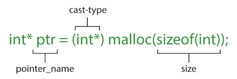

# **0x0C. C - More malloc, free**

# Tasks

## **0. Trust no one**
A function that allocates memory using malloc
> void *malloc_checked(unsigned int b);
[0-malloc_checked.c](https://github.com/Viestar/alx-low_level_programming/commit/3cb40f8b0d541d51d2a32627f210553567c040eb)

## **1. string_nconcat**
A function that concatenates two strings.
> char *string_nconcat(char *s1, char *s2, unsigned int n);
[1-string_nconcat.c](https://github.com/Viestar/alx-low_level_programming/commit/be761cccbde1074efbf62f26c5ed880a80b88b63)

## **2. _calloc**
A function that allocates memory for an array, using malloc.
> void *_calloc(unsigned int nmemb, unsigned int size);
[2-calloc.c](https://github.com/Viestar/alx-low_level_programming/commit/f8cf982b46b634e900fed3f2baeabe31f857b61d)

## **3. array_range**
A function that creates an array of integers.
> int *array_range(int min, int max);
[3-array_range.c](https://github.com/Viestar/alx-low_level_programming/commit/dbaa558db72ac4a84b67646471b5865e799c984e)

## **4. _realloc**
A  function that reallocates a memory block using malloc and free.
> void *_realloc(void *ptr, unsigned int old_size, unsigned int new_size);
[100-realloc.c](https://github.com/Viestar/alx-low_level_programming/commit/dbaa558db72ac4a84b67646471b5865e799c984e)