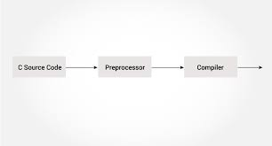
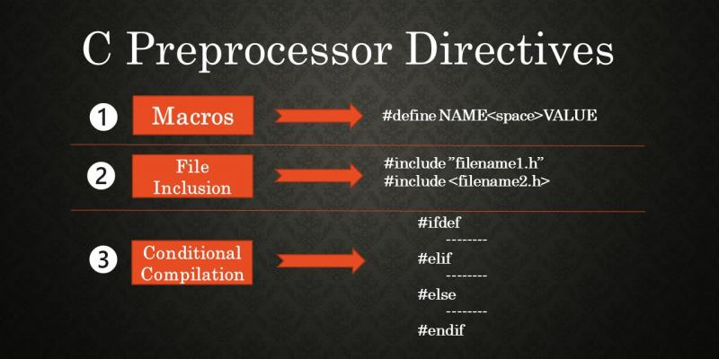

# **0x0D. C - Preprocessor**

> ## The process

> ## Contents

# Tasks

## **0. Object-like Macro**
A header file that defines a macro named SIZE as an abbreviation for the token 1024.
> [0-object_like_macro.h](https://github.com/Viestar/alx-low_level_programming/commit/84e5a2918909652ce7aeba81841742d5ed3c40a4)

## **1. Pi**
A header file that defines a macro named PI as an abbreviation for the token 3.14159265359
> [1-pi.h](https://github.com/Viestar/alx-low_level_programming/commit/5ddcd7045423e2d74c685f7acf5f6f93ec6ad3ef)

## **2. File name**
A program that prints the name of the file it was compiled from, followed by a new line
> [2-main.c](https://github.com/Viestar/alx-low_level_programming/commit/a058d7ebec720b800362f68c4907d9bdd5425d01)

## **03. Function-like macro**
A function-like macro ABS(x) that computes the absolute value of a number x
> [3-function_like_macro.h](https://github.com/Viestar/alx-low_level_programming/commit/f2c480507ada83208dcbe64cf2449edaf49dee42)

## **4. SUM**
A function-like macro SUM(x, y) that computes the sum of the numbers x and y.
> [4-sum.h](https://github.com/Viestar/alx-low_level_programming/commit/f2c480507ada83208dcbe64cf2449edaf49dee42)

