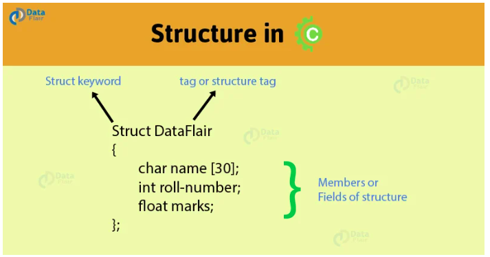

**0x0E. C - Structures, typedef**

> ### A Structure is a user defined data types with multiple related variables,
### They could be of different data types and are stored in one block of memory.
### They are like **Classes** of languages like **Python** without methods though.

> ## In a snapshot

# Tasks

## **0. Poppy**
A header file that declares a struct of a dog with name, age and owner.
> [dog.h](https://github.com/Viestar/alx-low_level_programming/commit/ec03e344f861e13422f93b4eb07cfb8ba5ce0481)

> 

## **1. A dog is the only thing on earth that loves you more than you love yourself**
A function that initialize a variable of type struct dog.
> void init_dog(struct dog *d, char *name, float age, char *owner);

> [1-init_dog.c](https://github.com/Viestar/alx-low_level_programming/commit/4adebe54efc8dd6db416a07596d094ebf21148e1)

## **2. A dog will teach you unconditional love. If you can have that in your life, things won't be too bad**
A function that prints a struct dog.
> void print_dog(struct dog *d);

> [2-print_dog.c](https://github.com/Viestar/alx-low_level_programming/commit/d3333cfe9247ce3cfee916e478eee7110d1a2e55)

## **3. Outside of a dog, a book is a man's best friend. Inside of a dog it's too dark to read**
Definition of type dog_t as a new name for the type struct dog
> [dog.h](https://github.com/Viestar/alx-low_level_programming/commit/c43ec94b1a24d67a8f82e060654170f45588b28)

## **5. How many legs does a dog have if you call his tail a leg? Four. Saying that a tail is a leg doesn't make it a leg**
A function that frees dogs.
> [4-new_dog.c](https://github.com/Viestar/alx-low_level_programming/commit/1069d76bf474560f91629950ef300af5ac470cdb)

## **4. A door is what a dog is perpetually on the wrong side of**
A function that creates a new dog
> [4-new_dog.c](https://github.com/Viestar/alx-low_level_programming/commit/5ed405b0fe95c9ce037dbf4928d81701af09f04f)