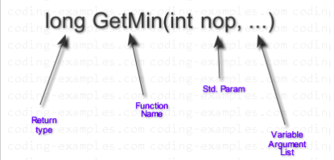

# **0x10. C - Variadic functions**

## NUTSHELL
> #### - A variadic function is one that takes a variable/any number of arguments.
> #### - The above is made possible during declaration;
> > i.e an ellipsis **"..."** is included as the last parameter.
> > Therefore any variadic function should atleast have one required argument. 
> #### - it uses macros from **<stdarg.h>** library e.g ;
> > 1.  **"va_list"** - datatype that stores a list all arguments,
> > 2. **"va_start"** - Initialises the arguments list for va_arg & va_end,
> > 3. **"va_arg"** - retrieves the next variable argument whenever called,
> > 4. **"va_end"** - Unidentifies the variable list of arguments,
> > 4. etc.

## SNAPSHOT

# Tasks

## **0. Beauty is variable, ugliness is constant**
A function that returns the sum of all its parameters.
> [0-print_numbers.c](https://github.com/Viestar/alx-low_level_programming/commit/94fdeb4c372bcb3b82a797d084522efefd457c7f)

## **1. To be is to be the value of a variable**
A function that prints numbers, followed by a new line.
> [1-print_numbers.c](https://github.com/Viestar/alx-low_level_programming/commit/2606342b6811b4110ff04fe759892d69b941d4f1)

## **2. One woman's constant is another woman's variable**
A function that prints strings, followed by a new line.
> [2-print_strings.c](https://github.com/Viestar/alx-low_level_programming/commit/3fcad84535b8277a2c840c5477da7ed49d89aa5c)

## **3. To be is a to be the value of a variable**
> Coming soon