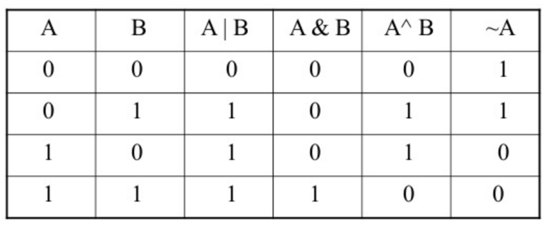

# 0x14. C - Bit manipulation

## NUTSHELL

> #### - AND (&), OR (|), XOR (^) Operators are in comparisons.
>
> #### - Left shift ("<<") is eqivalent to multipliction by 2.
>
> #### - Right shift (">>") is eqivalent to division by 2.

## SNAPSHOT

# Tasks

## **0. 0**

A function that converts a binary number to an unsigned int.

> [0-binary_to_uint.c](https://github.com/Viestar/alx-low_level_programming/commit/)

## **1. 1**

A function that prints the binary representation of a number.

> [1. List length](https://github.com/Viestar/alx-low_level_programming/commit/)

## **2. 10**

A function that returns the value of a bit at a given index.

> [2-get_bit.c](https://github.com/Viestar/alx-low_level_programming/commit/)

## **3. 11**

A function that sets the value of a bit to 1 at a given index.

> [3-set_bit.c](https://github.com/Viestar/alx-low_level_programming/commit/)

## **4. 100**

A function that sets the vlue of a bit to 0 t given index.

> [4-clear_bit.c](https://github.com/Viestar/alx-low_level_programming/commit/)

## **5. 101**

A function that returns the number of bits you would need to flip to get from one number to another

> [5-flip_bits.c](https://github.com/Viestar/alx-low_level_programming/commit/)

## **6. Endianness**

A function that checks for endianness

> [100-get_endianness.c](https://github.com/Viestar/alx-low_level_programming/commit/)

## **7. Crackme3**

Finding password of a given program.

> [101-password](https://github.com/Viestar/alx-low_level_programming/commit/)
