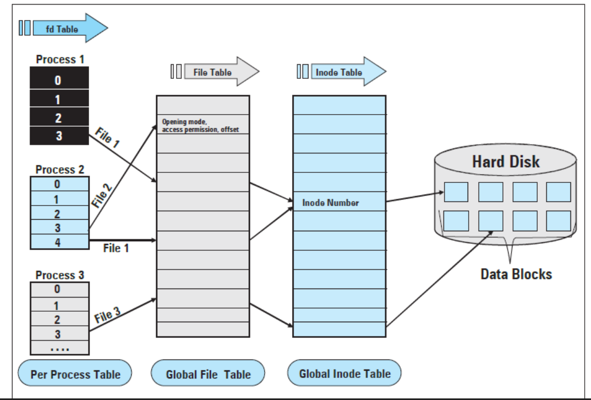

# 0x15. C - File I/O

## NUTSHELL

> #### - File Descriptors are unsigned integers handlers for I/O resources.

## SNAPSHOT

# Tasks

## **0.Tread lightly, she is near**

A function that reads a text file and prints it to the POSIX standard output

> [0-read_textfile.c](https://github.com/Viestar/alx-low_level_programming/commit/e1a084b70898c26bfe8bd025c3dc3e307655173d)

## **1. Under the snow**

A function that creates a file.

> [1-create_file.c](https://github.com/Viestar/alx-low_level_programming/commit/16a247f714e1e7f38679ccc812f813e2c3a39797)

## **2. Speak gently, she can hear**

A function that appends text at the end of a file.

> [2-append_text_to_file.c](https://github.com/Viestar/alx-low_level_programming/commit/)

## **3. cp**

A program that copies the content of a file to another file.

> [3-cp.c](https://github.com/Viestar/alx-low_level_programming/commit/)

## **4. elf**

A Program that displays the information contained int the ELF header at the start of an ELF file.

> [100-elf_header.c](https://github.com/Viestar/alx-low_level_programming/commit/)
