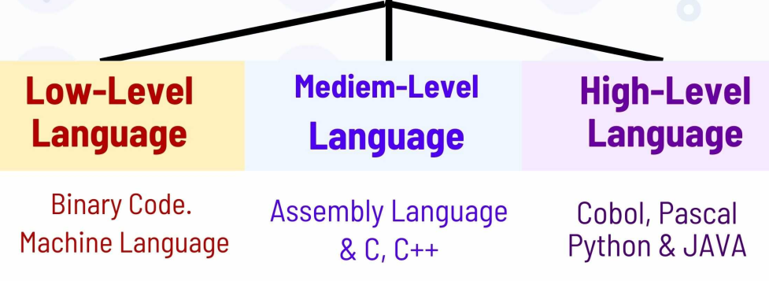

# ALX Low level Programming

> ## Starting with C language

## **0X00** Hello world - Introductory
## **0x01** Functions and nested loops
## **0x03** Debugging
## **0x04** More functions and nested loops.
## **0x05** Pointers arrays and strings
## **0x06** C - More pointers, arrays and strings
## **0x07** C - Even more pointers, arrays and strings## **0x08** Recursion
## **0x09** Static libraries
## **0x0A** Argc and Argv
## **0x0B** C - Malloc, Free
## **0x0C** C - More Malloc, Free
